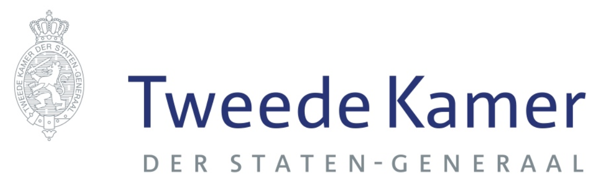
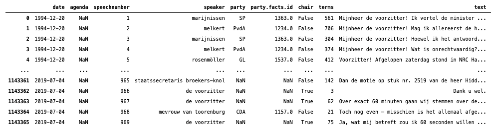
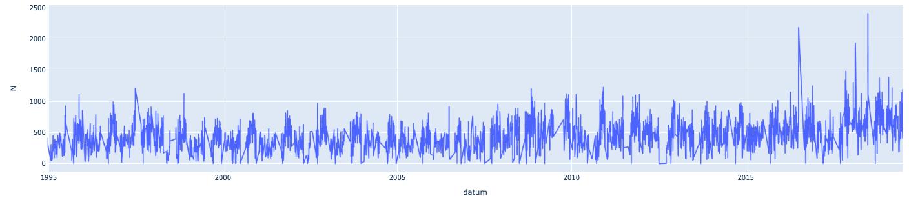
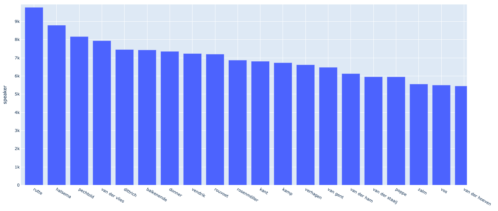
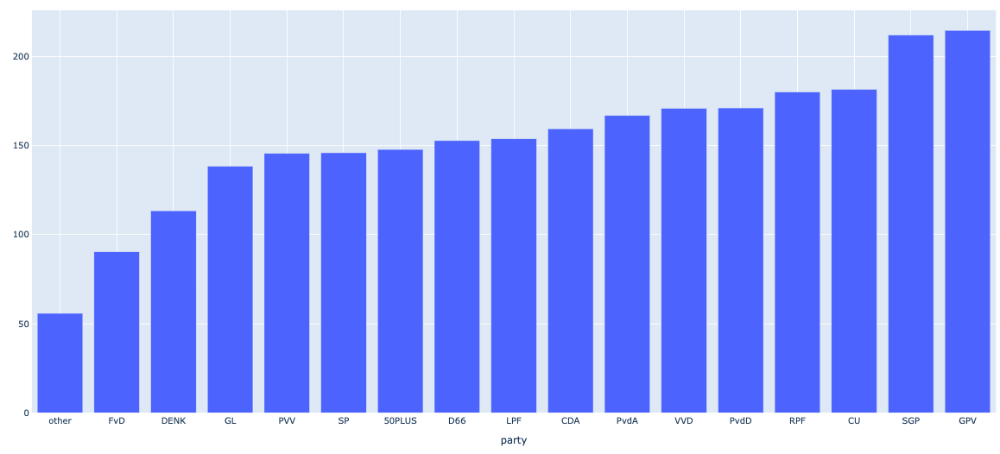
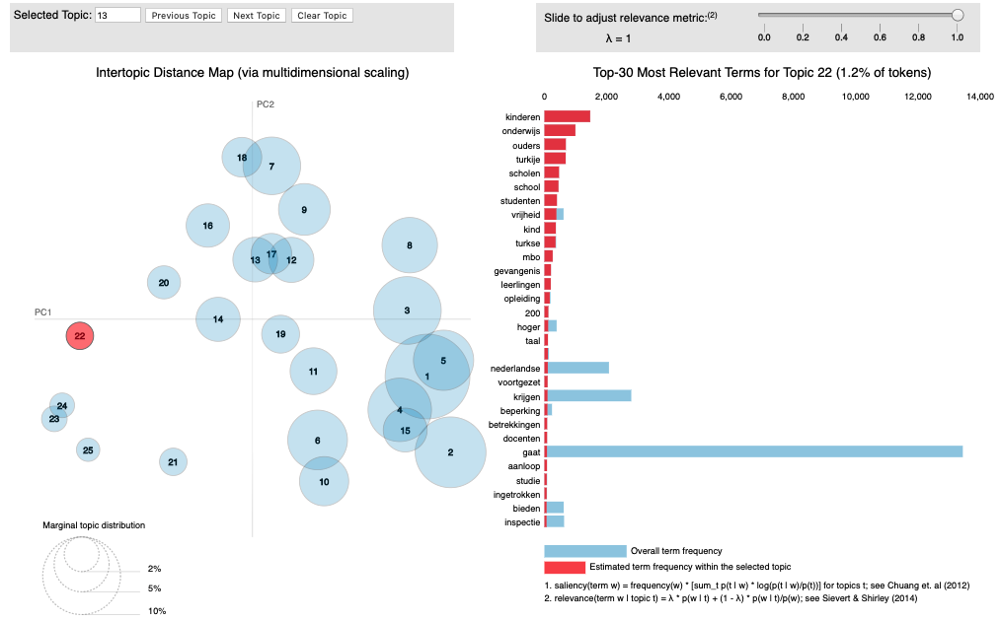

# Speeches en debat teksten

Alle Tweede Kamer parlementaire debatten van januari-1995 t/m juni-2019 zijn in een data set verzameld. Dat is het werk van:

**Rauh, Christian; Schwalbach**, Jan, 2020, Zie [hier voor de paper](https://doi.org/10.7910/DVN/L4OAKN/C2TWCZ) en [hier voor de data](https://dataverse.harvard.edu/dataset.xhtml?persistentId=doi:10.7910/DVN/L4OAKN).

De data was verzameld in een R rds file, deze heb ik in een csv file gezet en gezipped. De zip is te groot om in zijn geheel op GitHub te zetten, dus heb ik de command line tool `split` gebruikt om 24 Mb chuncks te maken: CorpusTweedeKamera .... CorpusTweedekamerl. Eenmaal van GitHub gehaald kan je deze losse sets weer concatenaten tot 1 zip en inlezen.

De data set bestaat uit ruim 1.1 mln. regels. Elke regel bevat de naam van de partij, de naam van de spreker, de datum en tekst.

### **Analyze mogelijkheden**

Er zijn tal van analyze mogelijkheden op deze data set:

* Metadata analyse
* Topic modeling [see notebook](https://nbviewer.jupyter.org/github/longhowlam/kamer_debatten/blob/master/tweede_kamer_Topic_Modeling.ipynb)
* Word2Vec
* Text Classificatie model (Target is politieke partij)
* TF Sentence Embedding
* Transformers text generation, [see here](https://github.com/huggingface/transformers)
* en nog andere dingen

***

***

 

# Metadata analyse

### **dagelijkse aantallen**

De parlement-speech data beslaat een periode van januari 1995 tot en met juni 2019. Onderstaande grafiek geeft het aantal speeches per dag aan.

Het schommelt rond de 500 per dag in de begin jaren waarna het iets oploopt.

### **top sprekers**

De top sprekers worden weergegeven in de volgende grafiek. Het zijn Rutte, Halsema en Pechthold, gevolgd door anderen.....

### **gemiddeld aantal woorden per partij**

Als we kijken naar het gemiddeld aantal woorden van de speeches per partij zien we de 'gelovige' partijen SGP en GPV er boven uitsteken met 211 en 214 woorden gemiddeld.  

# Topic modeling

### **LDA**

Met 'klassieke' Latent Dirichlet Allocation kan je een eerste inzicht krijgen in de topics die er zijn in de vele kamer speeches. 
Een LDA met 25 topics is getraind, zie onderstaande figuur.

Diverse onderwerpen komen naar voren zoals:

* Onderwijs,
* Gevangenissen,
* Belastingdienst toeslagen

Zie hier voor [interactieve versie](https://longhowlam.github.io/kamer_debatten/topics_lda.html)

### **top2vec**

Zie hier 2D umapped doc2vec embeddings [deze plotly plot](https://longhowlam.github.io/kamer_debatten/kamer_speeches_umapped.html)
